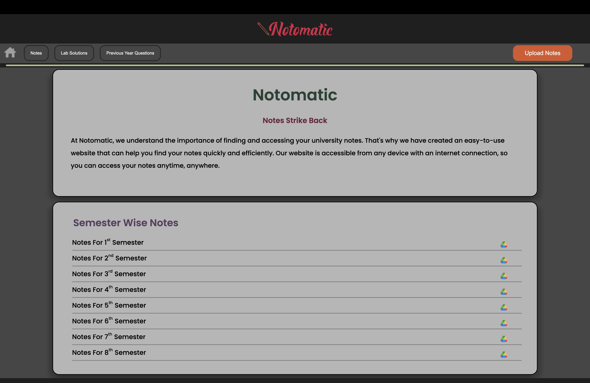
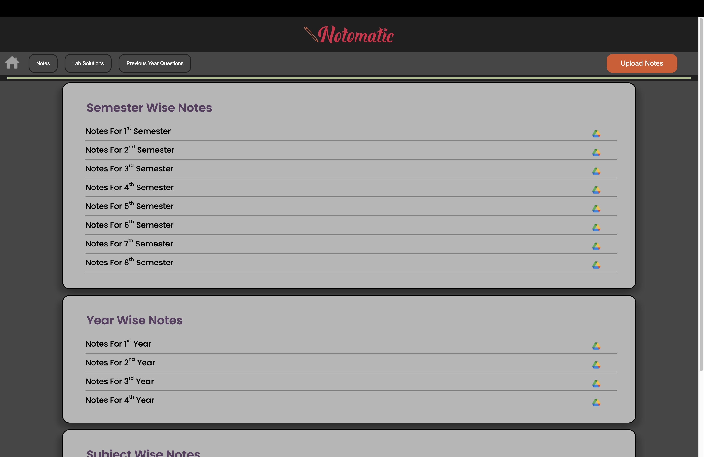
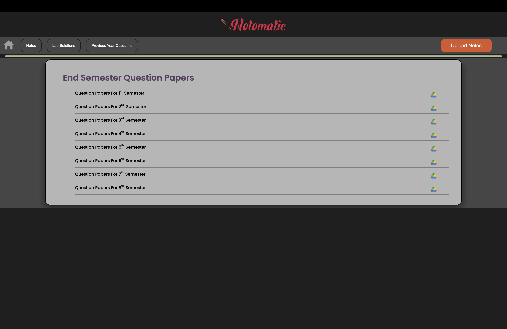

# Notomatic

This website can be used to save and upload notes that can be used by a school or college to study from.

## Tech Stack

This is a very basic project and can be recreated by just using HTML, CSS

## Screenshots
<ul align="center">
  <p>


</p>
</ul>

## Setup

```git clone https://github.com/TartejBrothexrs/Notomatic.git```

```cd Notomatic-main```
